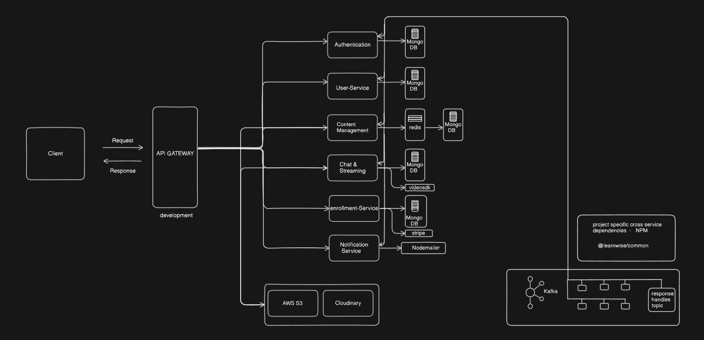

# Learnwise

> Learnwise is an innovative educational networking platform designed to connect learners and instructors for seamless knowledge sharing. Our platform empowers instructors to create courses, exams, live sessions, and announcements, enriching the learning experience.

## Repositories and Documentation

- **[Frontend Repository](https://github.com/Rithick574/learnwise-client)**
- **[Cross Service Package](https://github.com/Rithick574/learnwise-common)**
- **[API Documentation](https://documenter.getpostman.com/view/29232780/2sA35MyyuE#c2608f91-cc90-4761-9c44-1dffbb42fd1c)**
- **[Design and Prototype](https://www.figma.com/proto/YNzyixMYNNkbCi3NcF4ZJe/LearnWise?node-id=1-4&starting-point-node-id=1%3A4)**
- **[Database Design](https://app.codeplanner.co/projects/660f84a75e644605f0256a7c/databases/660f84be5e644605f0256a86)**

## Key Features

- **Diverse Course Offerings**: Access a wide range of free and paid courses. Videos are converted to HLS format (m3u8) to ensure optimal streaming quality based on internet speed.
  
- **Real-time Interaction**: Engage with real-time features such as text chatting, audio, video, and file sharing using WebSockets, fostering an engaging learning environment.
  
- **Live Streaming**: Instructors can conduct live streaming sessions, providing direct interaction and real-time feedback to enhance the learning experience.
  
- **Announcement System**: Stay informed with notifications about upcoming courses, live sessions, and achievements. Integrated options for likes, dislikes, and comments allow users to interact with announcements.

## Technical Architecture

- **Microservices Architecture**: Designed for scalability using microservices and clean architecture principles.
  
- **Efficient Communication**: Utilizes Apache Kafka for interservice communication.
  
- **Containerization and Deployment**: Leveraged Docker for containerization and deployed on Azure Kubernetes Service for streamlined deployment and optimal performance.

---
